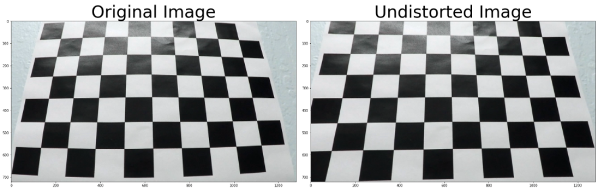
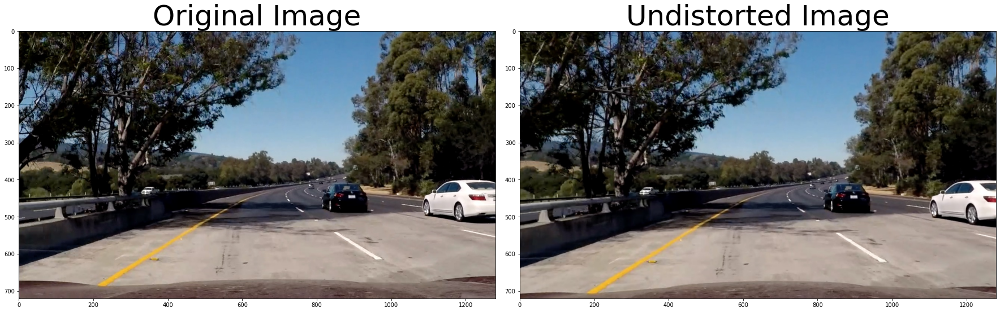
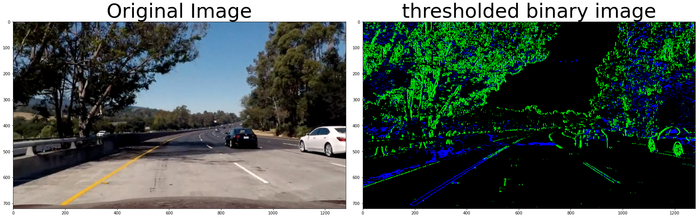
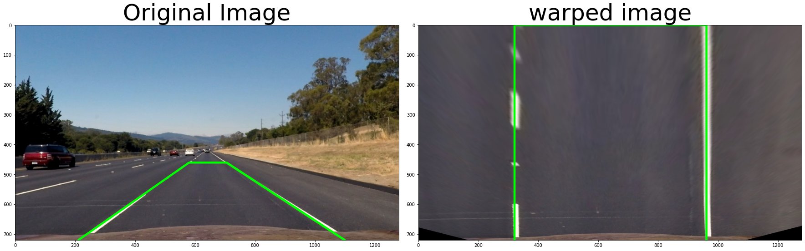
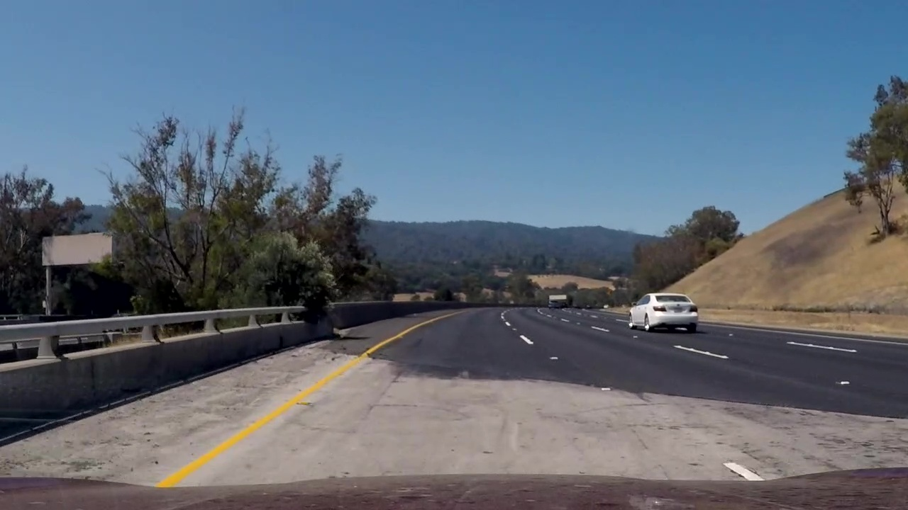
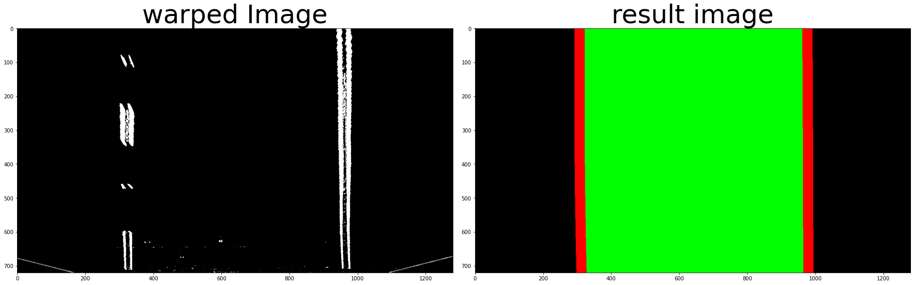
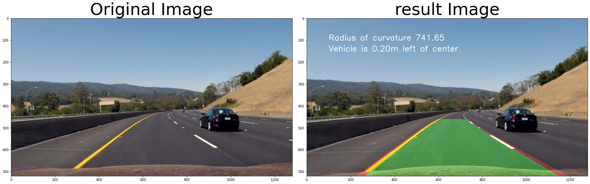

## Writeup 

**Advanced Lane Finding Project**

The goals / steps of this project are the following:

* Compute the camera calibration matrix and distortion coefficients given a set of chessboard images.
* Apply a distortion correction to raw images.
* Use color transforms, gradients, etc., to create a thresholded binary image.
* Apply a perspective transform to rectify binary image ("birds-eye view").
* Detect lane pixels and fit to find the lane boundary.
* Determine the curvature of the lane and vehicle position with respect to center.
* Warp the detected lane boundaries back onto the original image.
* Output visual display of the lane boundaries and numerical estimation of lane curvature and vehicle position.

## [Rubric](https://review.udacity.com/#!/rubrics/571/view) Points

### Here I will consider the rubric points individually and describe how I addressed each point in my implementation.  

---

### Camera Calibration

#### 1. Briefly state how you computed the camera matrix and distortion coefficients. Provide an example of a distortion corrected calibration image.

The code for this step is contained in the secode code cell of the IPython notebook located in `project.ipynb`

1. first I create the datasets for `cv2.calibrateCamera()` from ideal and real chess board conners point.  
   1. objpoint array which is a array contain ideal positions of conners size (54, 3), 54 come from number of conner 9x6 and it have value ([0-8], [0-5], 0). the third column is zero because it is 2d. by doing it I create zero array with size(54, 3) then I fill column 0 and 1 with pair of [0-8] and [0-5] created by `np.mgrid` transpose and reshape to (54, 2)

   2. the real conner'positions, to get it, I convert the chess board image in `camera_cal` to gray then use `cv2.findChessboardCorners` to find the conners. the chess board conner number must be 9 x 6 otherwise I will ignore it. 
   
2. then I process every image in `camera_cal`, after it success finding the conners I will append the result to array `imgpoints` and append objpoint to array `objpoints`. with this I can finally get the datasets for calibate distortion.

3. after I got the datasets I can use `cv2.calibrateCamera(objpoints, imgpoints, img.shape[::-1], None, None)` to get `mtx, dist` then use those two with `cv2.undistort(img, mtx, dist, None, mtx)` to calibate every image before process anything else.

### Pipeline (single images)

#### 1. Provide an example of a distortion-corrected image.

To demonstrate this step, I will describe how I apply the distortion correction to one of the test images like this one:
1. after I got an image, I will call function `cal_undistort(image, mtx, dist)` in `line 89 utils.py` the input are an image and mtx, dist from previous step. it will return undistored image.

#### 2. Describe how (and identify where in your code) you used color transforms, gradients or other methods to create a thresholded binary image.  Provide an example of a binary image result.

the code for this step is contained in function `pipeline()` in `utils.py` and sample code of this function is in the 5 code cell of the IPython notebook located in `project.ipynb`

1. convert the image rgb to hls by using `cv2.cvtColor(img, cv2.COLOR_RGB2HLS)`
2. I use light channel that contain good edge and conner as the input for sobel. Since the road image contains mostly vertical lines, so I apply only sobelx. after that I apply absolute and normalize the output then apply threshold to find the pixel with value within threshold range.
3. but light channel lack the yellow lane information, it need saturation channel to fill that path, I apply threshold to saturation channel if the lower bound too high, the lane information will miss when the road is too bright and if the upper bound too high, I will got exceeding information when the road is too dark. so after tunning the threshold `(120, 180)` is the good trade off.
4. then I do combine those two output together to get the final result.

#### 3. Describe how (and identify where in your code) you performed a perspective transform and provide an example of a transformed image.

the code for this step is contained in in the 6 code cell of the IPython notebook located in `project.ipynb`
by using `cv2.getPerspectiveTransform()` and `cv2.warpPerspective()`. I can get the bird eye view image.
but I need to adjust parameter to get the parallel line.
This resulted in the following source and destination points:
| Source        | Destination   | 
|:-------------:|:-------------:| 
| 210, 720      | 320, 720        | 
| 580, 460      | 320, 0      |
| 705, 460     | 960, 0      |
| 1000, 720      | 960, 720        |

I verified that my perspective transform was working as expected by drawing the `src` and `dst` points onto a test image and its warped counterpart to verify that the lines appear parallel in the warped image.

#### 4. Describe how (and identify where in your code) you identified lane-line pixels and fit their positions with a polynomial? and Describe how (and identify where in your code) you calculated the radius of curvature of the lane and the position of the vehicle with respect to center.

the code for this step is contained in the 7-8 code cell of the IPython notebook located in `project.ipynb` and function `find_lane_pixels()` in `line 4 utils.py` 
1. First, I warp the image into bird eye view then create a thresholded binary image by using function `pipeline()` in `utils.py` then I will fill `[:, 0:100] and [:, 1180:1280]` with zero to reduce noise.
2. after that I call function `find_lane_pixels()` in `line 4 utils.py` by using the thresholded binary image as its input. This function will return lanes image, left lane polynomial, right lane polynomial, curve, distance from center  
   
   1. Let looking at `find_lane_pixels()`. First, I find the base line for left and right lane by looking the peak value of left and right side from histogram created from sum the image by verticle not just lower half because I face a problem from image below the right lane lower half are fade. with this solution I can solve the problem but the lane is more wobbly. then start from each base line at the bottom of the image. I apply 10 sliding windows with margin 100 stacked in vericle line. To collect the curve pixel, each sliding window need to adjust middle position of the next(upper) sliding windwos by counting all pixel within the current window. If it has more pixel than 50. The window position wii be mean of all pixel in the current window. once it loop through all sliding, it will return curve line pixel for left and right lane. 
    
   2. after I got the urve line pixel for left and right lane. I use `fit_polynomial` in `line 174 utils.py` to calculate polynomial for left and right lane.
   3. for the radius of curvature I multiply curve line pixel from 1. with ratio 30/720 for y dimension and 3.7/700 x dimension then call `fit_polynomial` again to find polynomial in real world scale. Now I apply `radius_curvature()` in `line 210 utils.py`  to find the radius of curvature.
   4. the position of the vehicle, I calculate the middle of the road by  `(leftbaseline - rightbaseline)/2`. for the middle of the car I assume it is 720 which is image widht/2. with `(the middle of the road - the middle of the car)*3.7/700 ` I now get the position of the vehicle.

#### 5. Provide an example image of your result plotted back down onto the road such that the lane area is identified clearly.
the code for this step is contained in the 10-11 code cell of the IPython notebook located in `project.ipynb` .  Here is an example of my result on a test image:

---

### Pipeline (video)

#### 1. Provide a link to your final video output.  Your pipeline should perform reasonably well on the entire project video (wobbly lines are ok but no catastrophic failures that would cause the car to drive off the road!).

Here's a [link to my video result](https://drive.google.com/file/d/1gRmBSrqNPiZjgnJTSW8zWe0L4tg54h7J/view?usp=sharing) or [this link](./test_videos_output/project_video16.mp4)

---

### Discussion

#### 1. Briefly discuss any problems / issues you faced in your implementation of this project.  Where will your pipeline likely fail?  What could you do to make it more robust?

first problem brightness of the road. It take me several hour to find the right trade off threshold.
seconde problem is sometime surrounding object yield more information than the lanes, like the edge of the road or the car. to solve this problem, I ignore all the information within 100px from left and right of the warped image  
third problem is sometime the lane is fade or too far. Looking at the histogram create from only bottom half will cause missing baseline. To solve this I create histogram from whole image but It cause another problem which is inaccurate baseline but I think it acceptable.
